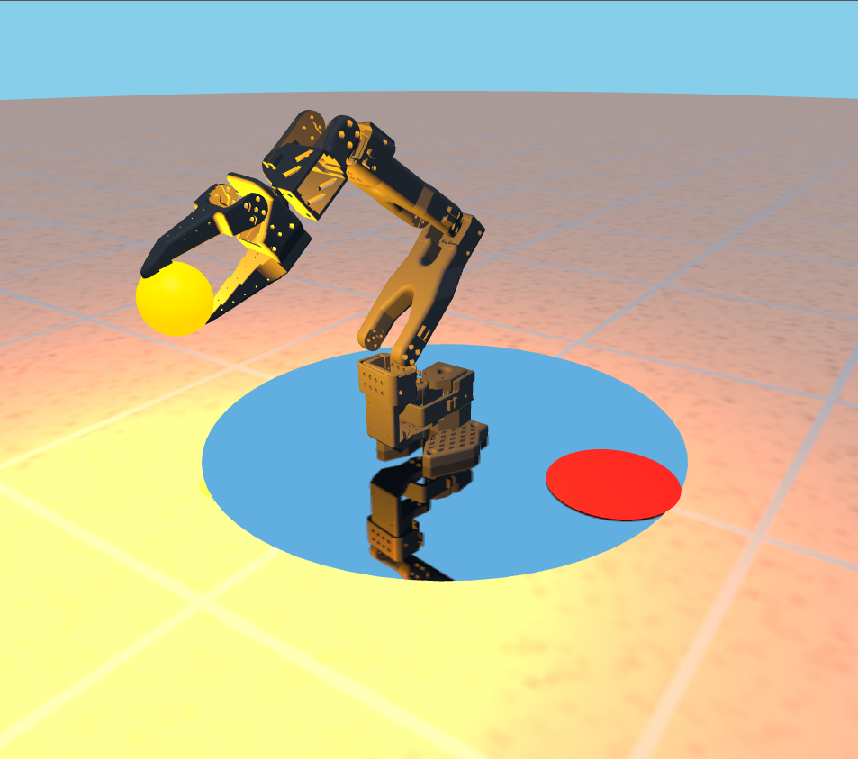

# SO-101 Digital Twin

Browser-based 3D interactive digital twin of the SO-101 6-DOF robotic arm, built with Three.js and Cannon.js.

**Live:** https://gitsimone2001.github.io/SO-101-Digital-Twin/



---

## Run locally

**Terminal 1 — web app:**

```bash
cd SO-101-Digital-Twin
npm install
npx vite
```

Opens at http://localhost:5173.

**Terminal 2 — hardware bridge** (only needed for live mode, requires physical arm on `/dev/ttyACM0`):

```bash
cd /path/to/SO-101
source lerobot-env/bin/activate
python /path/to/SO-101-Digital-Twin/robot/bridge.py
```

Click **Live** in the side panel to start mirroring the physical arm.

---

## Controls

### Keyboard — joint control

| Joint | Key |
|---|---|
| Shoulder pan | A / D |
| Upper arm | W / S |
| Lower arm | I / K |
| Wrist pitch | J / L |
| Wrist roll | U / O |
| Jaw (gripper) | Q / E |

**Camera:** left-drag to orbit, scroll to zoom, right-drag to pan.

### UI panel

| Control | Description |
|---|---|
| Studio / Warm / Cold / Dark | Switch lighting preset |
| Sphere light | Toggle the point light attached to the ball |
| Sphere light slider | Adjust point light intensity (0–4) |
| Floor shininess slider | Adjust floor specular shininess |
| Reset | Return arm to home pose and respawn the ball |
| Live | Toggle live mirroring from the physical arm via WebSocket bridge |

### Pick-and-place game

Move the arm over the orange ball and bring the jaw to **~+0.62 rad** offset to grasp it. Open past **+0.64 rad** to release. Land the ball on the red target circle to score; the target moves each round. Current score is shown top-left.

---

## Project structure

```
index.html                  UI and entry point
css/styles.css              styling
js/
  main.js                   scene, lights, physics, animation loop, bridge client
  robotArm.js               RobotArm class — GLB loading, kinematics, joint limits
  cannon.js                 Cannon.js bundled
public/assets/models/       GLB arm parts (Base, Pivot, Upper Arm, Lower Arm, Wrist Pitch, Wrist Roll, Jaw)
robot/
  bridge.py                 reads motor angles at 30 Hz, streams JSON over WebSocket
  test_motors.py            manual motor test (requires physical arm)
source-assets/models/       original GLB/STL files from SO-ARM100 CAD (pre-Blender reassembly)
documentation/              report PDF and coordinate reference
```

---

## Robot / bridge layer

`robot/bridge.py` is a Python asyncio WebSocket server that:

1. Loads per-joint calibration from `~/.cache/huggingface/lerobot/calibration/teleoperators/so_leader/my_leader_arm.json`
2. Connects to the physical arm via `FeetechMotorsBus` (LeRobot) on `/dev/ttyACM0`
3. Polls all 6 `Present_Position` values at 30 Hz
4. Broadcasts a JSON object to every connected browser client: `{ "shoulder_pan": °, "shoulder_lift": °, ... }`

**Dependencies:** HuggingFace LeRobot (cloned at `SO-101/lerobot/`) + the `websockets` package.

```bash
cd /path/to/SO-101
source lerobot-env/bin/activate
pip install websockets          # one-time
python path/to/robot/bridge.py
```

The browser (`main.js`) connects automatically on load and reconnects every 2 s if the socket drops. Live mirroring is applied only when the **Live** button is active.

---

## Kinematic chain

The arm uses **forward kinematics** only. Each joint is a `THREE.Group` with its position and quaternion extracted from the Blender assembly. Joints are chained via `parent.attach(child)` so rotations propagate automatically:

```
basePivot
  └─ shoulderPivot   (rotates Z)
       └─ upperArmPivot   (rotates Y)
            └─ lowerArmPivot   (rotates Z)
                 └─ wristPitchPivot   (rotates Y)
                      └─ wristRollPivot   (rotates Y)
                           └─ jawPivot   (rotates Y)
```

All models are scaled by 0.001 to convert millimeters → meters.

---

## Physics + gripper

The bouncing sphere is a `CANNON.Body` (mass 1 kg, radius 2.5 cm). Each frame:

1. If not attached: step the physics world, sync the Three.js mesh to the body position.
2. Check distance from sphere to the jaw's grasp point (offset from `jawPivot` world position).
3. If within 2.5 cm **and** jaw is at the grasp angle (~+0.62 rad offset): switch body to `KINEMATIC`, zero velocity → sphere locks to jaw.
4. If attached: override sphere position to the grasp point every frame.
5. If attached and jaw opens past +0.64 rad: detach and switch body back to `DYNAMIC`.

---

## Stack

- [Three.js r184](https://threejs.org) — WebGL rendering
- [cannon-es v0.20](https://github.com/pmndrs/cannon-es) — physics (bundled as `js/cannon.js`)
- [Vite](https://vitejs.dev) — dev server and bundler
- [LeRobot](https://huggingface.co/docs/lerobot/index) — motor interface (bridge only)
- [SO-ARM100 CAD files](https://github.com/TheRobotStudio/SO-ARM100) — source models, converted to GLB via Blender
